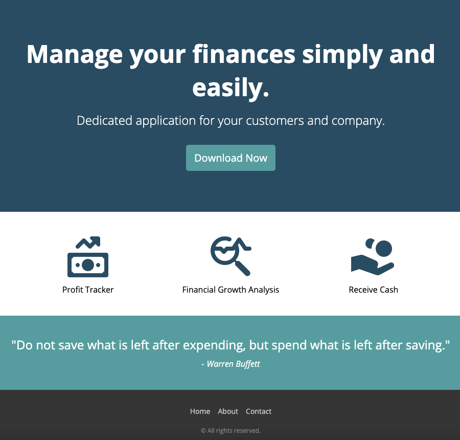

# Finance App - Responsive Web Design

This is a solution to a basic Finance App landing page. In the process of building this single page I managed to gain a greater understanding of responsive web design and making websites that can adapt to every device and every screen size.  

## Table of contents

- [Overview](#overview)
  - [The challenge](#the-challenge)
  - [Screenshot](#screenshot)
  - [Links](#links)
- [My process](#my-process)
  - [Built with](#built-with)
  - [What I learnt](#what-i-learnt)
  - [Useful resources](#useful-resources)
- [Author](#author)

## Overview

### The challenge

Users should be able to:

View the optimal layout depending on their device's screen size

### Screenshot



Above is what you should see when you click on the link below.

### Links

- GitHub URL: [Code](https://github.com/Max88-git/finance-app)
- Live Site URL: [Live Site](https://max88-git.github.io/finance-app/)

## My process

### Built with

- Semantic HTML5 markup
- CSS custom properties
- jQuery 3.6.0
- Flexbox
- Animations

### What I learnt

- I learnt how to build modern, responsive websites using HTML and CSS.
- How to add some functionality using JavaScript to make a sliding submenu button, which improve the user experience and aesthetics.
- Use relative units (such as percentages) for the sizes of the elements and fonts.
- Use CSS media queries to define breakpoints and layout changes.
- Define the viewport to adapt to mobile screens.
- Use CSS Flexbox to make it easier to create flexible layouts.
- Styling for both desktop and mobile devices.

Here are some code snippets I am proud of:

```css
.feature {
		width: 100%;
		display: flex;
		flex-direction: column;
		align-items: center;
		justify-content: center;
		text-align: left;
		margin: 0 0 15px 0;
		font-size: 16px;
	}
```
```js
$(function() {
	$('.btn').click(function() {
		$('.submenu').slideToggle(500);
	});
});
```

### Useful resources

- [CSS-TRICKS Flexbox](https://css-tricks.com/snippets/css/a-guide-to-flexbox/) -This helped me learn about all the different properties of flexbox and about the parent (flex container) and the children (flex items).
- [YESVIZ Screen Dimensions for Devices](https://yesviz.com/) - A useful website for finding out about different screen sizes, viewport sizes, css media queries and resolution for all kinds of devices including phones, tablets, smart watches and laptops. 


## Author

- Website - [Max Lockwood](https://www.maxlockwood.uk/)

